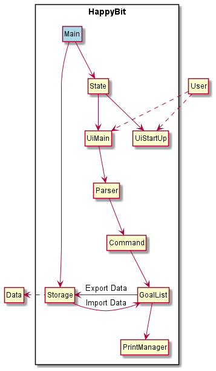
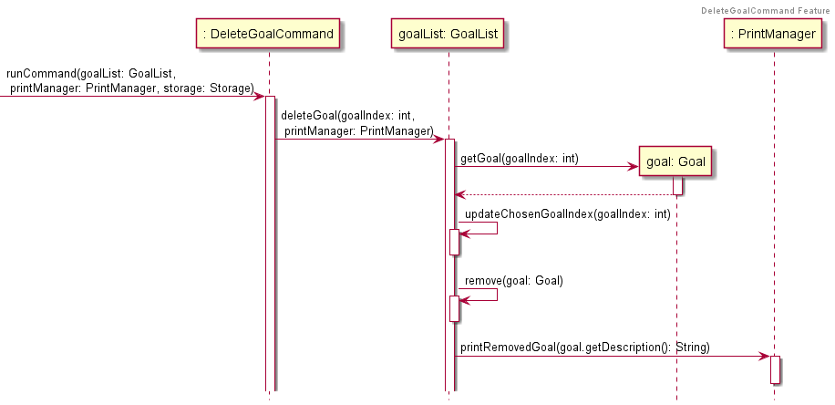
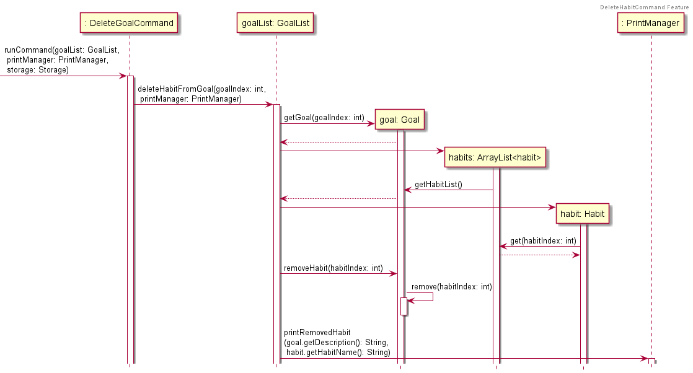
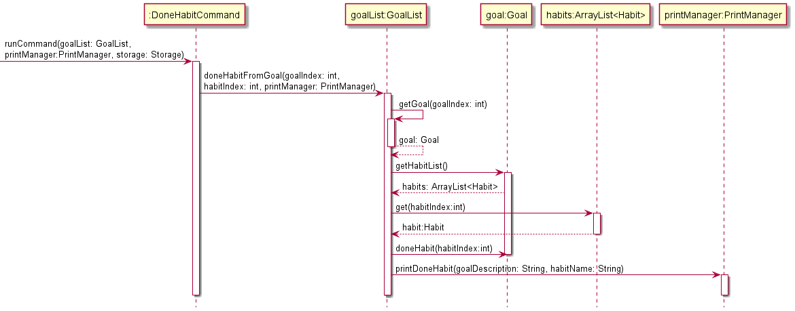
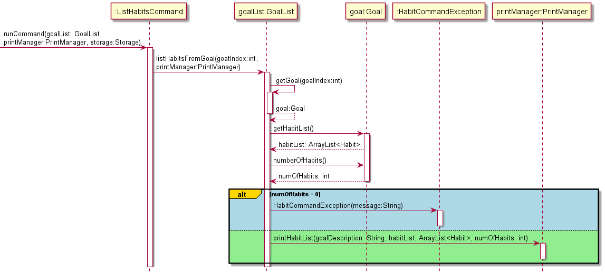

# Developer Guide

This developer guide documents the design and implementation of the application,
_Ha(ppy)Bit_. It will provide an insight into the design considerations, and implementation
of features.

* [Acknowledgements](#acknowledgements)
* [Design and Implementation](#design-and-implementation)
  * [Architecture](#architecture)
  * [UI component](#ui-component)
  * [Command component](#command-component)
  * [Parser logic component](#parser-logic-component)
  * [GoalList component](#goallist-component)
  * [Storage component](#storage-component)
* [Appendix A: Product Scope](#appendix-a-product-scope)
  * [Target user profile](#target-user-profile)
  * [Value proposition](#value-proposition)
* [Appendix B: User Stories](#appendix-b-user-stories)
* [Appendix C: Non-Functional Requirements](#appendix-c-non-functional-requirements)
* [Appendix D: Glossary](#appendix-d-glossary)
* [Appendix E: Instructions for Manual Testing](#appendix-e-instructions-for-manual-testing)

---------------------------------------------------------------------------------------------------------

## Acknowledgements

This application reused some parts of the code from:
* Developer's name: Daren Tan (find his profile [here](AboutUs.md))
* Code source: CS2113T Individual Project
* Link to code: <https://github.com/DJ-Tan/ip.git>

This application referenced some parts of the code from:
* Developer team: find the team [here](https://se-education.org/addressbook-level3/AboutUs.html)
* Code source: AB-3
* Link to code: <https://github.com/se-edu/addressbook-level3.git>

This application adapted the Developer Guide and User Guide from:
* Developer team: find the team [here](https://se-education.org/addressbook-level3/AboutUs.html)
* Link to Developer Guide: <https://se-education.org/addressbook-level3/DeveloperGuide.html>
* Link to User Guide: <https://se-education.org/addressbook-level3/UserGuide.html#quick-start>

---------------------------------------------------------------------------------------------------------

## Design and Implementation

### Architecture

The diagram below shows the higher-level implementation of the interactions of all the components within `HappyBit` 

In the sections below, we will be explaining in detail how each compomponent works.

### UI component

**API** : `Ui.java`

How the `Ui` component works:
1. The `Ui` is called in 2 main classes - `GoalList` and `UiOverall`
2. For `GoalList`, functions that require printing of information will call `Ui`
   1. confirmation message of `addGoal()`
   2. confirmation message of `addHabitToGoal()`
   3. removed goal of `deleteGoal()`
   4. removed habit of `deleteHabitFromGoal()`
   5. confirmation message of `doneHabitFromGoal()`
   6. update message of `updateGoalName()`
   7. list of goals of `listGoals()`
   8. list of habits of `listHabitsFromGoal()`
3. For `UiOverall`, there is an inheritance of 2 classes - `UiStartup` and `UiMain`
   1. `UiStartup` handles the interface that provides a brief introduction to the application, and links to external 
      documentation.
   2. `UiMain` handles the interface for the main application.
4. The `Ui` is responsible for printing error messages raised by exceptions.

The Sequence Diagram below illustrates the interactions within the `Ui` component when `run()` is called in the main
class `HappyBit.java`

While the Sequence Diagram represents the normal flow of logic, there is a recursive definition that is not represented.
1. `:HappyBit` calls the method `handleState()` in `:State`
2. `handleState()` calls another method `mainState()` also in `:State`
3. `mainState()` will create a new `:UiMain` and calls a method `run()` on itself
4. `run()` returns a boolean value equivalent to whether the recursive call should be made
5. If the boolean value is true, `handleState()` would recursively call itself
6. If the boolean value is false, `handleState()` would pass the call back to `:HappyBit`

### Command component

When the user runs the Program, the main function dealing with the user's inputs is the `handleUserInput()` function
which obtains a `Command` object after parsing the input using the `Parser` component.

`Command` objects available are:
* `AddGoalCommand` - Adds a new Goal to the GoalList.
* `AddHabitCommand` - Adds a new Habit object to a specified Goal set by the user.
* `UpdateGoalNameCommand` - Updates the name of a Goal specified by the user.
* `DeleteGoalCommand` - Deletes a Goal from the GoalList
* `DeleteHabitCommand` - Deletes a Habit object from a specified Goal set by the user.
* `DoneHabitCommand` - Marks a Habit object under a Goal as done.
* `ListGoalCommand` - Lists out all the Goals set by the user.
* `ListHabitCommand` - Lists out all the Habits set under a Goal.
* `HelpCommand` - Prints out message indicating all the available Commands

The respective `runCommand` functions of the returned command object is then executed.
In the sections below we will be providing implementation details for each of the commands.

#### `AddGoalCommand`

When the `runCommand` function is executed for the `AddGoalCommand` object, the following steps as indicated by the
sequence diagram below is carried out:

#### `AddHabitCommand`

#### `UpdateGoalNameCommand`

#### `DeleteGoalCommand`

When the `runCommand` function is executed for the `DeleteGoalCommand` object, the following steps as indicated by the
sequence diagram below is carried out:

#### `DeleteHabitCommand`

When the `runCommand` function is executed for the `DeleteHabitCommand` object, the following steps as indicated by the
sequence diagram below is carried out:

#### `DoneHabitCommand`

When the `runCommand` function is executed for the `DoneHabitCommand` object, the following steps as indicated by the 
sequence diagram below is carried out:

#### `ListGoalCommand`

When the `runCommand` function is executed for the `ListGoalsCommand` object, the following steps as indicated by the
sequence diagram below is carried out:

#### `ListHabitCommand`

When the `runCommand` function is executed for the `ListHabitsCommand` object, the following steps as indicated by the
sequence diagram below is carried out:

#### `HelpCommand`

When the `runCommand` function is executed for the `HelpCommand` object, it instantiates a `PrintManager` object and 
calls the `printCommandList` method which prints out a pre-set message informing the user of all the inputs they
can type to execute a certain command.

### Parser logic component

The `Parser` logic component handles the parsing of the input passed in by the user and returns a suitable `Command` 
object that will be executed. Within the component itself, there are more specific and detailed `Parser` classes for 
handling various inputs from the user.

* `AddParser` - Handles the parsing of inputs starting with `set` and `add` keywords
* `DeleteParser` - Handles the parsing of inputs starting with `remove` and `delete`
* `DoneParser` - Handles the parsing of inputs starting with `done`
* `ListParser` - Handles the parsing of inputs starting with `view`
* `SetParser` - Handles the parsing of inputs starting with `goal`

For inputs of `bye`, `help` `list` their respective functions are run immediately without the need to parse further.

For any other invalid inputs that do not start with the listed keywords, the `HelpCommand` functionality is invoked.

### GoalList component

The `GoalList` component is the component that holds and manipulates the list of all the Goals set by the user.
All `runCommands` of all of the `Command` objects directly access the `GoalList` component to retrieve and change      
the user's data.

### Storage component

**API:** `Storage.java`

The Storage Class allows data to be read from and saved to a storage file. When a user exits the program, the 
information entered by the user during the program will be exported and saved into a `HappyBit.txt` file. The next time
the program is run by the user, this data will be imported back into the program to allow the user to pick up and 
continue from where they left off.

---------------------------------------------------------------------------------------------------------

## Appendix A: Product Scope

### Target user profile:
* wants to have a work-life balance but is often consumed by work/school
* have goals and aspirations but falls short of them; lacklustre commitment or game plan for action
* doesn't want to rely on smartphone (They're doing everything these days, sheesh!)
* prefers desktop app, 
* familiar and comfortable with CLI apps, or willing to learn to use

### Value proposition

Users with _Ha(ppy)Bit_ will find themselves cultivating good habits and breaking bad habits despite hectic 
workload or commitments. 

## Appendix B: User Stories

|Version| As a ... | I want to ... | So that I can ...|
|--------|----------|---------------|------------------|
|v1.0|new user|see usage instructions|refer to them when I forget how to use the application| 
|v1.0|user|set a new goal I wish to accomplish|start working towards completing the goal|
|v1.0|user|add habits i wish to carry out in the process of accomplishing my goal|break down the journey of achieving my goal into smaller manageable steps
|v1.0|user|remove a goal from my list of goals|remove goals that I no longer wish to work towards|
|v1.0|user|delete a habit added under a goal|remove a habit that I no longer wish to carry out|
|v1.0|user|mark a habit as done|indicate that I have completed that habit|
|v1.0|user|list out all the goals I have|remind myself of the goals I am working towards|
|v1.0|user|view all the habits I have set for each goal|check which habits I have yet to complete|
|v1.0|user|have import and export functionality in the program|access goals and habits previously set from a local data storage
|v2.0|user|have recurring habits at a regular interval|habitually carry out the habits I set for myself|
|v2.0|user|be able to view my progress for any goal|motivate myself in the process|
|v2.0|user|view all my habits due for the day upon entering the program|remember to carry out these habits by the end of the day|

## Appendix C: Non-Functional Requirements

|Non-Functional Requirements | Requirement Type |
| :---------- | :---: |
|App should be operable on Windows, macOS, and Ubuntu running Java `11` or above.|Technical|
|App can be learned anyone who is familiar with computer within minutes of use.|Quality|
|App should be a helpful, encouraging, and a joy to use.|Quality|
| |Performance|

## Appendix D: Glossary

* **Goal**: A long term achievement you wish to accomplish
* **Habit**: Checkpoints; actionable tasks to be done to achieve goal

## Appendix E: Instructions for Manual Testing

{Someone shall give instructions on how to do a manual product testing 
e.g., how to load sample data to be used for testing}
