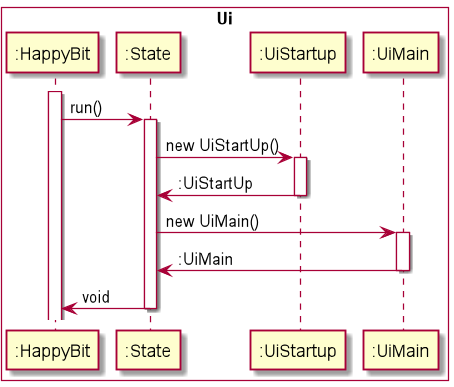

# Developer Guide

This developer guide documents the design and implementation of the application,
Ha(ppy)Bit. It will provide an insight into the design considerations, and implementation
of features.

* [Acknowledgements](#acknowledgements)
* [Design and Implementation](#design-and-implementation)
  * [Architecture](#architecture)
  * [UI component](#printManager-component)
  * [Command component](#command-component)
  * [Parser logic component](#parser-logic-component)
  * [GoalList component](#goallist-component)
  * [Storage component](#storage-component)
* [Appendix A: Product Scope](#appendix-a-product-scope)
  * [Target user profile](#target-user-profile)
  * [Value proposition](#value-proposition)
* [Appendix B: User Stories](#appendix-b-user-stories)
* [Appendix C: Non-Functional Requirements](#appendix-c-non-functional-requirements)
* [Appendix D: Glossary](#appendix-d-glossary)
* [Appendix E: Instructions for Manual Testing](#appendix-e-instructions-for-manual-testing)

## Acknowledgements

This application reused some parts of the code from:
* Developer's name: Daren Tan (find his profile [here](AboutUs.md))
* Code source: CS2113T Individual Project
* Link to code: <https://github.com/DJ-Tan/ip.git>

This application referenced some parts of the code from:
* Developer team: find the team [here](https://se-education.org/addressbook-level3/AboutUs.html)
* Code source: AB-3
* Link to code: <https://github.com/se-edu/addressbook-level3.git>

This application adapted the Developer Guide and User Guide from:
* Developer team: find the team [here](https://se-education.org/addressbook-level3/AboutUs.html)
* Link to Developer Guide: <https://se-education.org/addressbook-level3/DeveloperGuide.html>
* Link to User Guide: <https://se-education.org/addressbook-level3/UserGuide.html#quick-start>

## Design and Implementation

### Architecture

The diagram below shows the higher-level implementation of the interactions of all the components within `HappyBit` 

In the sections below, we will be explaining in detail how each compomponent works.

### UI component

**API** : `Ui.java`

How the `Ui` component works:
1. The `Ui` is called in 2 main classes - `GoalList` and `UiOverall`
2. For `GoalList`, functions that require printing of information will call `Ui`
   1. confirmation message of `addGoal()`
   2. confirmation message of `addHabitToGoal()`
   3. removed goal of `deleteGoal()`
   4. removed habit of `deleteHabitFromGoal()`
   5. confirmation message of `doneHabitFromGoal()`
   6. update message of `updateGoalName()`
   7. list of goals of `listGoals()`
   8. list of habits of `listHabitsFromGoal()`
3. For `UiOverall`, there is an inheritance of 2 classes - `UiStartup` and `UiMain`
   1. `UiStartup` handles the interface that provides a brief introduction to the application, and links to external 
      documentation.
   2. `UiMain` handles the interface for the main application.
4. The `Ui` is responsible for printing error messages raised by exceptions.

The Sequence Diagram below illustrates the interactions within the `Ui` component when `run()` is called in the main
class `HappyBit.java`

While the Sequence Diagram represents the normal flow of logic, there is a recursive definition that is not represented.
1. `:HappyBit` calls the method `handleState()` in `:State`
2. `handleState()` calls another method `mainState()` also in `:State`
3. `mainState()` will create a new `:UiMain` and calls a method `run()` on itself
4. `run()` returns a boolean value equivalent to whether the recursive call should be made
5. If the boolean value is true, `handleState()` would recursively call itself
6. If the boolean value is false, `handleState()` would pass the call back to `:HappyBit`

### Command component
When the user runs the Program, the main function dealing with the user's inputs is the `handleUserInput()` function
which obtains a `Command` object after parsing the input using the `Parser` component.

`Command` objects available are:
* `AddGoalCommand` - Adds a new Goal to the GoalList.
* `AddHabitCommand` - Adds a new Habit object to a specified Goal set by the user.
* `DeleteGoalCommand` - Deletes a Goal from the GoalList
* `DeleteHabitCommand` - Deletes a Habit object from a specified Goal set by the user.
* `DoneHabitCommand` - Marks a Habit object under a Goal as done.
* `ListGoalCommand` - Lists out all the Goals set by the user.
* `ListHabitCommand` - Lists out all the Habits set under a Goal.
* `HelpCommand` - Prints out message indicating all the available Commands

The respective `runCommand` functions of the returned command object is then executed.
In the sections below we will be providing implementation details for each of the commands.

#### `AddGoalCommand`

#### `AddHabitCommand`

#### `DeleteGoalCommand`

#### `DeleteHabitCommand`

#### `DoneHabitCommand`

When the `runCommand` function is executed for the `DoneHabitCommand` object, the following steps as indicated by the 
sequence diagram below is carried out.

#### `ListGoalCommand`

When the `runCommand` function is executed for the `ListGoalsCommand` object, the following steps as indicated by the
sequence diagram below is carried out.

#### `ListHabitCommand`

When the `runCommand` function is executed for the `ListHabitsCommand` object, the following steps as indicated by the
sequence diagram below is carried out.

#### `HelpCommand`

When the `runCommand` function is executed for the `HelpCommand` object, it instantiates a `PrintManager` object and 
calls the `printCommandList` method which prints out a pre-set message informing the user of all the inputs they
can type to execute a certain command.

### Parser logic component

The `Parser` logic component 

### GoalList component

### Storage component

## Appendix A: Product Scope

### Target user profile:
* wants to have a work-life balance but is often consumed by work/school
* have goals and aspirations but falls short of them; lacklustre commitment or game plan for action
* doesn't want to rely on smartphone (They're doing everything these days, sheesh!)
* prefers desktop app, 
* familiar and comfortable with CLI apps, or willing to learn to use

### Value proposition

{Describe the value proposition: what problem does it solve?}

Users with _Ha(ppy)Bit_ will find themselves cultivating good habits despite hectic 
workload/commitments from school (we targeting work and school?). 

## Appendix B: User Stories

|Version| As a ... | I want to ... | So that I can ...|
|--------|----------|---------------|------------------|
|v1.0|new user|see usage instructions|refer to them when I forget how to use the application| 
|v2.0|user|find a to-do item by name|locate a to-do without having to go through the entire list|

## Appendix C: Non-Functional Requirements

{Give non-functional requirements}

## Appendix D: Glossary

* *glossary item* - Definition

## Appendix E: Instructions for Manual Testing

{Give instructions on how to do a manual product testing e.g., how to load sample data to be used for testing}
